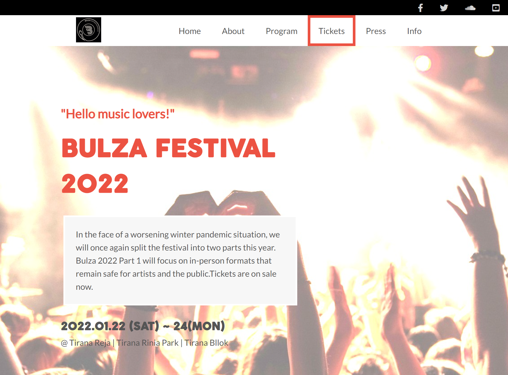

# Project Name

> Festival Page

This festival page is my first try at building a web page with HTML/CSS & JavaScript.It is the first capstone project in Microverse Curriculum.The festival is fictional ,but the desire to see it coming to life (even just in a website form) motivated me to build it as best I could in the amount of time of 5days.

## Built With

- HTML
- CSS
- JavaScript

## Live Demo

[Live Demo Link](https://myelin0.github.io/Capstone/index.html)

## Getting Started

To get a local copy up and running clone the repo below:

https://github.com/myelin0/Capstone

## Author

👤 **Emirjeta Veisllari**

- GitHub: [@myelin0](https://github.com/myelin0)
- Twitter: [@Amy_Albania](https://twitter.com/Amy_albania)
- LinkedIn: [@Emirjeta Veisllari](https://www.linkedin.com/in/emirjeta-veisllari/)

## 🤝 Contributing

Contributions, issues, and feature requests are welcome!

Feel free to check the [issues page](https://github.com/myelin0/Capstone/issues).

## Show your support

Give a ⭐️ if you like this project!

## Acknowledgments

- Hat tip to anyone whose code was used
Font Awesome 

- Inspiration
https://unsplash.com/photos/So6YckShOVA?utm_source=unsplash&utm_medium=referral&utm_content=creditShareLink
https://unsplash.com/photos/hzgs56Ze49s?utm_source=unsplash&utm_medium=referral&utm_content=creditShareLink
https://www.facebook.com/BulzaEntertainment/
https://www.facebook.com/antez.azimut
http://tiranaartlab.org/en
https://www.facebook.com/diversanti79
https://www.ctm-festival.de/
https://birrakorca.com.al/

friends & family

- etc

## 📝 License

This project is [MIT](./MIT.md) licensed.
